# PythonCookbook

Moje reposytorium jest pod linkiem https://github.com/beardydeer/PythonCookbook oraz nazywa się [beardydeer/PythonCookbook](https://github.com/beardydeer/PythonCookbook)

Moj plan na ten tydzien

|    | P  | W  | S | C    | P   | S | N |
|----|----|----|---|------|-----|---|---|
| 5  | 1  | 2  | 3 | 4    | 5   |   |   |
| 6  | al | m  | a | kota |     |   |   |
| 7  | ha | ha |   | a ty | nie |   |   |
| 8  |    |    |   |      |     |   |   |
| 9  |    |    |   |      |     |   |   |
| 10 |    |    |   |      |     |   |   |
|    |    |    |   |      |     |   |   |
|    |    |    |   |      |     |   |   |
| 5  | 1  | 2  | 3 | 4    | 5   |   |   |
| 6  | al | m  | a | kota |     |   |   |
| 7  | ha | ha |   | a ty | nie |   |   |
| 8  |    |    |   |      |     |   |   |
| 9  |    |    |   |      |     |   |   |
| 10 |    |    |   |      |     |   |   |
|    |    |    |   |      |     |   |   |
|    |    |    |   |      |     |   |   |

## Jak uzywać git?

### Tworzenie nowego archiwum 

```shell
git init
```

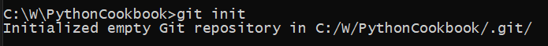

> Co to zrobiło?

Utworzenie kopii archiwum na moim komputerze. 

### Ustawienie danych użytkownika

#### Ustawienie emailu

```shell
git config --global user.email "you@example.com"
```

#### Ustawianie nazwy użytkownika

```shell
git config --global user.name "Your Name"
```

### Jak połączyć lokalne archiwum ze źródłem na github.com (zdalne archiwum)?

```shell
git remonte add origin http://github.com/beardydeer/PythonCookbook.git
```

### Jak sprawdzić co jest zmodyfikowane (stan/status archiwum)?


```shell
git status
```

#### Jeden plik 

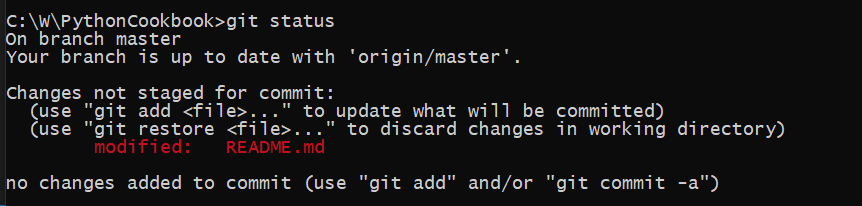

> Co to znaczy?

To znaczy że zmodyfikowano plik `README.md`. Ale ten plik nie jest zindeksowany (czerwony kolor), co jest nazywane brudnym plikiem. 

#### Wiele plików 

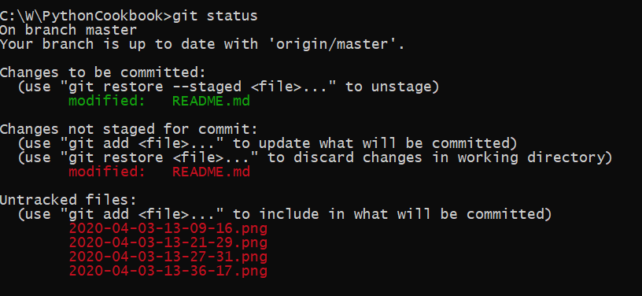 

> Co to znaczy?

To znaczy że zmodyfikowano pliki :

- `README.md` (zielony)
- `README.md` (czerwony)
- `2020-04-03-13-09-16.png` (czerwony)
- `2020-04-03-13-21-29.png` (czerwony)
- `2020-04-03-13-27-31.png` (czerwony)
- `2020-04-03-13-36-17.png` (czerwony)

Plik zielony jest zindeksowany, a pliki czerwone nie. Mamy sytuacje że plik `README.md` jest na zielono i czerwono. To znaczy że pewne zmiany w pliku `README.md` zindeksowane (`git add README.md`), a następnie pojawiły się nowe zmiany (brudne, czerwone). 


### Jak zidenksować moje modyfikacje (tymczasowo dodać zmiany do archiwum)?

#### Jeden plik (README.md)

```shell
git add README.md
```
> Co to znaczy?

To znaczy że modyfikacje w pliku `README.md` zideksowano.  

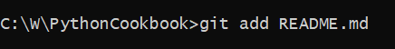 

> Ups jaki jest rezultat idenksowania, jak to sprawdzić?

```shell
git status
```

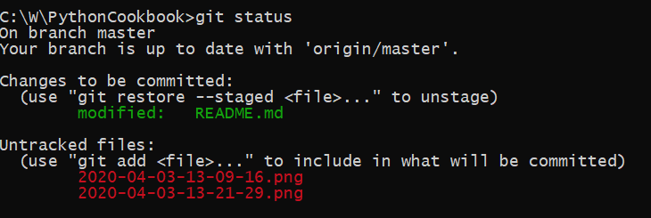

> O nie, nie wszystkie pliki są zindeksowane! Jak zindeksować wszystkie pliki?

#### Wszystkie pliki 

```shell
git add . 
```

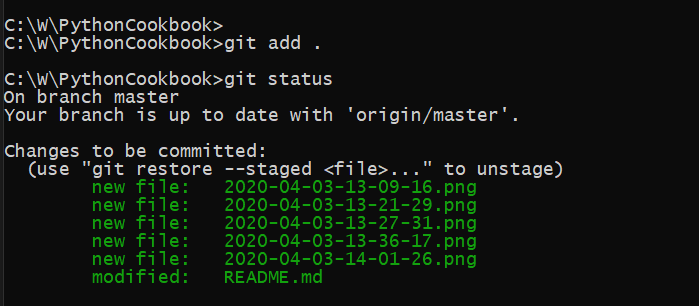

> Co to znaczy?

To znaczy że zindeksowano wszystkie pliki. A wiem to stąd, że wszystkie pliki są zielone.

### Jak zarchiwować moje zmiany?

#### Pierwszy commit

```shell
git commit -m "Pierwsze commit"
```

#### Drugi commit 

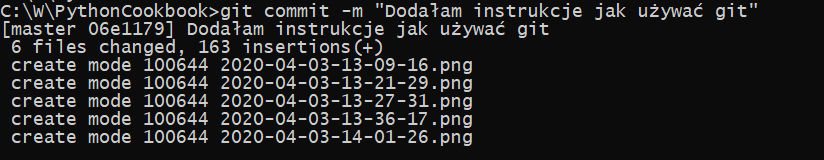

> Co to znaczy?

To znaczy, że 6 plików zostało zmodyfikowanych, ilość zmian wynosi 163 znaków (pojedyncze: litery, spacje, cyfry, itp.). W tym 5 nowych plików.

### Jak wgrać/wepchać  moje archiwum (ostatni commit) na github.com (zdalne archiwum)?

```shell
git push -u origin master 
```

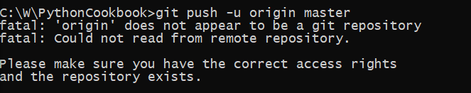 

> Co to znaczy?

To znaczy, że był błąd krytyczny, ponieważ wpisałam złą nazwę zdalnego repozytorium, jako `orgin`, a powinno być `origin`. 

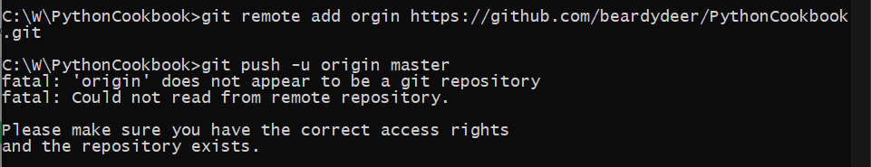 

Po podaniu prawidłowej nazwy `origin` 

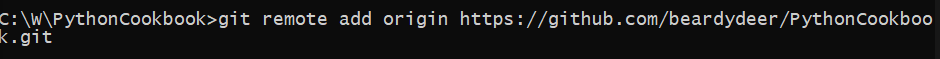 

Kolejna próba 

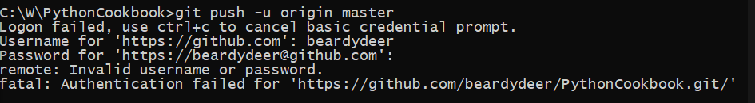

> Co to znaczy?

To znaczy, że był błąd krytyczny, ponieważ nie udało mi się zalogować. 

Kolejna próba 

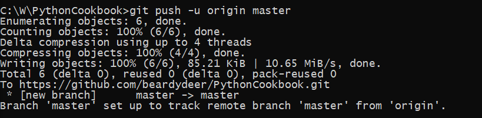

To znaczy, że był sukces, ponieważ git nie pokazał błędu oraz moje zmiany są na zdalnym repozytorium. 

#### Mój pierwszy push 

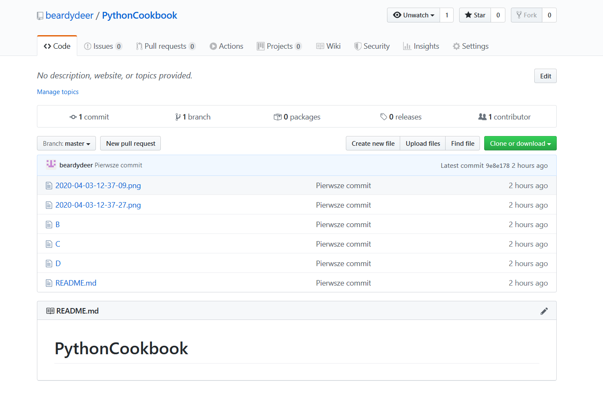

#### Mój drugi push

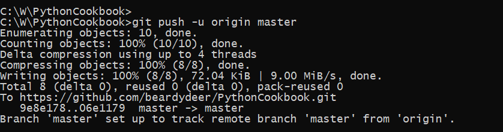

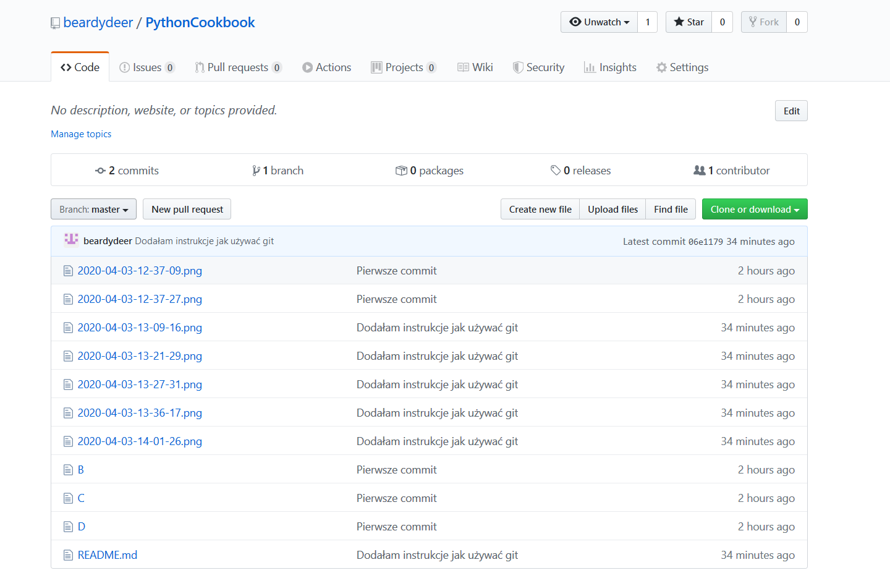

### Jak pokazać liste archiwów?

```shell
git log
```

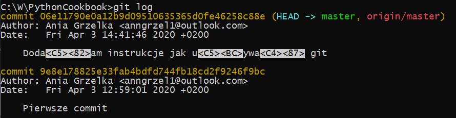

> Co to znaczy?

To znaczy, że mam liste archiwów: 

- o numerze: `06e11790e0a12b9d09510635365d0fe46258c88e`, tytule "Doda<C5><82>am instrukcje jak u<C5><BC>ywa<C4><87> git", autorze "Ania Grzelka <anngrzel1@outlook.com>" z dnia "Fri Apr 3 14:41:46 2020 +0200"
- o numerze: `9e8e178825e33fab4bdfd744fb18cd2f9246f9bc`, tytule " Pierwsze commit", autorze "Ania Grzelka <anngrzel1@outlook.com>" z dnia "Fri Apr 3 14:41:46 2020 +0200"


### Podsumowanie: Jak zapisać zmiany do archiwum zdalnego?

```shell
git status 
git add .
git commit -m "Podsumowałam instrukcję jak używać git"
git push -u origin master 
```


# BRUDNOPIS
Jestem tutaj


## Rozdział 1 ....

Wcale nie


### Podrozdział 1 ...

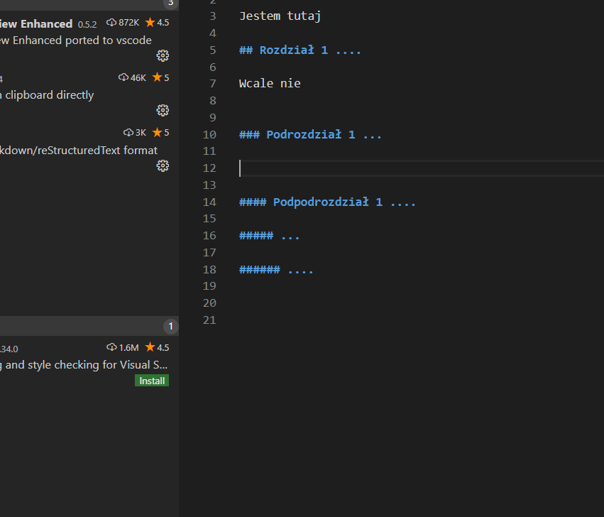

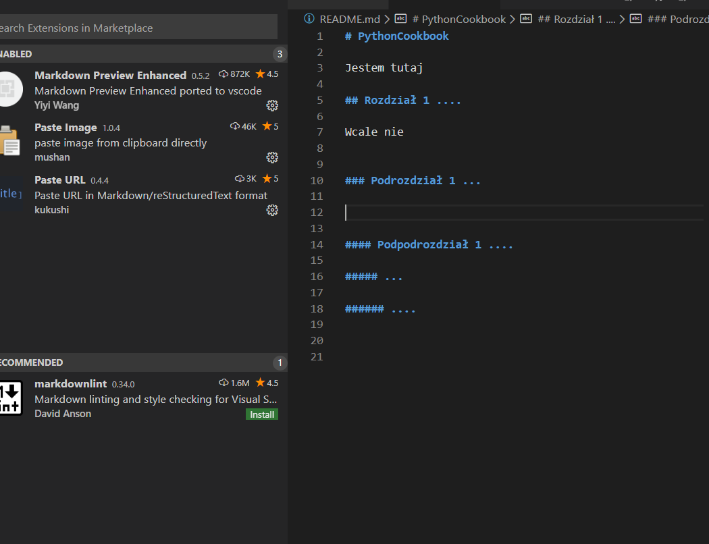


```py
print('Nie mam masła')

def maslo(ilosc, jakosc):
    print(ilosc, jakosc)
```

print('Nie mam masła')

def maslo(ilosc, jakosc):
    print(ilosc, jakosc)


#### Podpodrozdział 1 ....

##### ...

###### ....


